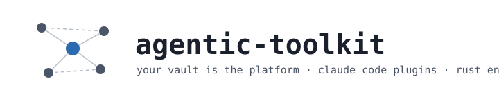
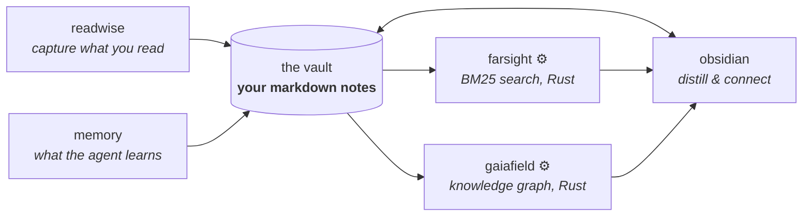
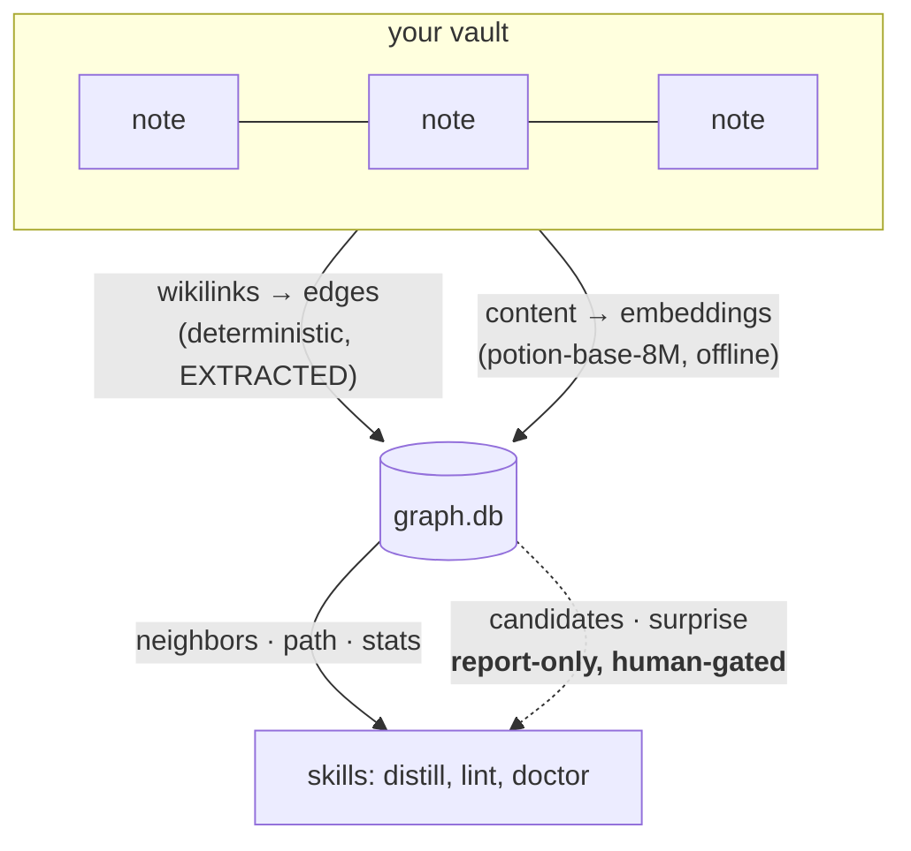

<picture>
  <source media="(prefers-color-scheme: dark)" srcset="assets/banner-dark.svg">
  
</picture>

[](https://github.com/marsmike/agentic-toolkit/actions/workflows/ci.yml)
[](https://marsmike.github.io/agentic-toolkit/)
[](LICENSE)
[](.claude-plugin/marketplace.json)

**Your notes become an operating system for AI agents.** This toolkit turns an
Obsidian-style markdown vault into the shared memory, knowledge graph, and
configuration source for a curated set of Claude Code plugins — with two Rust
engines underneath and one rule above everything: *the repo ships behavior;
your vault ships identity.* Nothing personal lives here.



## Pick your path

**🌱 New here — "what does this actually do for me?"**
No accounts, no API keys — three commands, then a 60-second real demo:

```bash
uv tool install git+https://github.com/marsmike/agentic-toolkit#subdirectory=core  # toolkit on PATH
toolkit engines install                                                            # sha256-recorded binaries
claude plugin marketplace add marsmike/agentic-toolkit                             # plugins
toolkit demo                                                                        # see it work, for real
```

**From source**: `git clone https://github.com/marsmike/agentic-toolkit && cd agentic-toolkit && uv run toolkit demo` — then `claude plugin marketplace add .` in place of the line above.

Then read the [Quick Start](https://marsmike.github.io/agentic-toolkit/04_Resources/Guides/Quick-Start)
and scaffold your own vault with `uv run toolkit vault init ~/my-vault`
(`export TOOLKIT_VAULT=~/my-vault` — tests/CI never touch your vault, only the bundled one).

**🔧 Intermediate — "I want to build on this."**
Start with [`contract/`](contract/) — the four short documents every plugin
obeys: the [vault schema](contract/VAULT_SCHEMA.md) (frontmatter is a floor,
not a ceiling), the [profile convention](contract/PROFILE.md) ("fill from
Obsidian": plugins read your identity from vault notes, never from the repo),
the [knowledge API](contract/KNOWLEDGE_API.md) (filesystem + CLI, ~35× cheaper
than MCP indirection), and [model routing](contract/ROUTING.md). Engines ship
as prebuilt binaries for macOS/Linux/Windows on every
[release](https://github.com/marsmike/agentic-toolkit/releases). Adding a
plugin: [CONTRIBUTING](CONTRIBUTING.md) — the admission bar is naming the
behavior it delivers and answering the dead-letter question.

**🔬 Expert — "show me the interesting parts."**
This repo doubles as a working lab for agentic-engineering practice, and every
mechanism is documented as a browsable knowledge graph:

- [**Report-only inference**](https://marsmike.github.io/agentic-toolkit/04_Resources/Concepts/Inference-Write-Policy) —
  the statistical graph layer can *suggest* but never *write*. The deterministic
  layer once shipped a silent-corruption bug; the inferred layer structurally
  cannot repeat it.
- [**Calibration bias**](https://marsmike.github.io/agentic-toolkit/04_Resources/Concepts/Calibration-Bias) —
  how pooled similarity statistics manufactured fake signal from cluster-size
  imbalance (70% of note pairs "related"), and the leave-one-out fix that took
  a probe note from 31 noise candidates to one correct one.
- [**The observer pattern**](https://marsmike.github.io/agentic-toolkit/04_Resources/Concepts/The-Observer-Pattern) —
  every builder deliverable is adversarially verified by an independent agent
  before it may merge. The observers' catches are in the
  [CHANGELOG](CHANGELOG.md) as receipts.
- [**The ratchet**](https://marsmike.github.io/agentic-toolkit/04_Resources/Concepts/The-Ratchet) —
  every rule in this repo cites the dated failure that earned it and names its
  removal condition. Grep the codebase for `[earned:` and judge for yourself.
- [**The cold-boot ritual**](https://marsmike.github.io/agentic-toolkit/04_Resources/Concepts/The-Cold-Boot-Ritual) —
  `scripts/coldboot.sh` re-lives the stranger experience before every release,
  up to and including a live headless `claude -p` session in an isolated config.
- [**The example vault is four things at once**](https://marsmike.github.io/agentic-toolkit/04_Resources/Guides/Test-Corpus-Map) —
  documentation, `vault init` template, deterministic test corpus with planted
  edge cases, and the eval substrate that gates every merge.

## The engines

| Engine | What | Why Rust | Docs |
|---|---|---|---|
| **farsight** | Stateless BM25 search over your notes — no index to go stale | 7 ms cold queries, single static binary, zero deps | [→](https://marsmike.github.io/agentic-toolkit/04_Resources/Tools/Farsight) |
| **gaiafield** | Knowledge graph: your wikilinks as deterministic edges (SQLite), plus a report-only inferred layer (static embeddings, model2vec) | graph traversal + embedding of the whole vault in seconds, offline | [→](https://marsmike.github.io/agentic-toolkit/04_Resources/Tools/Gaiafield) |

Both speak CLI-in/JSON-out only. Python skills prefer the binary when present
and degrade gracefully when it isn't — a fresh clone works before you download
anything.



## Documentation

**The site: https://marsmike.github.io/agentic-toolkit** — the vault *is* the
documentation, rendered with resolved wikilinks, backlinks, full-text search,
and an interactive graph view. There is no separate docs tree to drift out of
date, and the docs are periodically verified *against the codebase* — claims
that stop being true are treated as bugs.

Preview locally:

```bash
git clone --depth 1 --branch v4.5.2 https://github.com/jackyzha0/quartz /tmp/quartz
cp docs-site/quartz.config.ts docs-site/quartz.layout.ts /tmp/quartz/
rsync -a vault/ /tmp/quartz/content/ --exclude '00_Memory/' --exclude '01_Capture/' --exclude '.gaiafield/'
cp /tmp/quartz/content/Index.md /tmp/quartz/content/index.md
cd /tmp/quartz && npm i && npx quartz build --serve
```

## Layout

- [`contract/`](contract/) — the constitution: vault schema, profile convention, knowledge API, model routing
- [`core/`](core/) — the `toolkit` CLI (`vault init` · `doctor` · `profile`) and Python library
- [`vault/`](vault/) — the example vault: docs, demo, test corpus, and eval substrate in one
- [`plugins/`](plugins/) — curated plugins ([obsidian](plugins/obsidian/), [readwise](plugins/readwise/), [memory](plugins/memory/)), added one release at a time
- [`crates/`](crates/) — the Rust engines
- [`docs/PLAN.md`](docs/PLAN.md) — why everything is the way it is, with citations

## Scripting the toolkit (headless)

The plugins' skills shell out to scripts and engine binaries, so a headless
`claude -p` session needs explicit tool grants — the default permission mode
will block execution and the skills will (correctly) fall back to
filesystem-only analysis:

```bash
claude -p --allowedTools "Bash(uv run:*),Bash(uv:*),Bash(env:*),Bash(python3:*)" "..."
```

Note: `--allowedTools` takes **one comma-separated argument**, and `Bash(env:*)`
is required because skills compose `env VAR=... uv run ...` command lines.
Full guide: [Scripting the Toolkit](https://marsmike.github.io/agentic-toolkit/04_Resources/Guides/Scripting-the-Toolkit-Headless).

## Principles

Every rule traces to a dated failure. Every plugin declares where its failures
go. Capability evals graduate into regression gates. If a component's behavior
can't be named, it gets removed. The long version, with receipts:
[docs/PLAN.md](docs/PLAN.md) and the [CHANGELOG](CHANGELOG.md).
