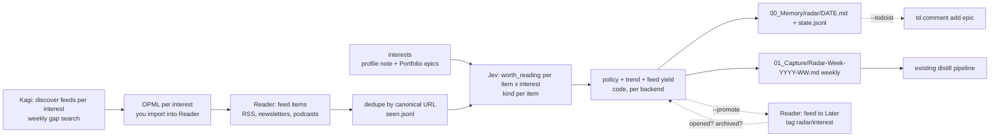

# Radar: agentic-toolkit as an active research tool (R10)

> **Where it landed (2026-09-23).** Built: `scan` (with archiving, which Mike asked for after the
> replay, and `--promote`), `replay`, `discover` (Kagi plus `--seed`), `feeds`, `trend`, `weekly`,
> the radar skill with scheduling, and four offline evals. Acceptance: steps 1–3 and 5 ran on the
> real account (numbers in `plugins/radar/README.md`); step 4 ran as discovery plus 14 feeds
> subscribed. Changed on evidence: `T_WORTH` 0.60 → 0.70 (blind audit), same-day AUC as the
> headline metric (a bookmark import made pooled recency look good), Reader archiving instead of
> "never touch Reader". Not built: `gaps`, `--todoist`, the Kagi skill.

## Context

Everything in agentic-toolkit runs *after* a clip: judge, link, check, retire. The clip itself,
the only research act in the loop, is "I stumble over a link". Measured today: Reader holds
**1,716 feed items from the last 30 days** (an embedded-systems OPML: arXiv 942, Phoronix 315,
Hackaday 271, LWN 92, CNX 67, Zephyr, Espressif) and **0 of them were ever opened**; in the same
window Mike clipped **55 items**, none from the feed. The ingest pipeline drops feed items by
design (`NOT_A_CLIPPING_LOCATION = "feed"`). The legacy toolkit had `research:kagi` (a launcher
for third-party Go binaries), a `trend-radar` workflow (one sub-agent per interest per source,
prose ranking, never measurable) and a `tech-radar` renderer; `docs/PLAN.md` already names
`research` and `tech-radar` as the next ports and the flywheel "research/readwise capture SOTA →
distill → tech-radar → …". The vault already carries the interest model
(`03_Areas/Trend Radar Profile.md`: 10 interests, 61 queries) and the target output shape
(`04_Resources/Guides/Trend Radar W12 2026 - Cross-Domain Intelligence Digest.md`).

Goal: a `radar` plugin that reads everything Reader aggregates, judges every item against Mike's active
interests with the typed-judgment backend (per item × interest, the same primitive as distill),
computes trends in code, and puts the result where Mike already looks: a daily note in
`00_Memory/radar/`, a weekly capture in `01_Capture/`, and a `[radar YYYY-MM-DD]` comment on the
Portfolio epic it concerns. The clip stays his; the pipeline behind it is unchanged. Prototype
and accept on the last month before anything is scheduled.

Decisions Mike already made: Jev via OpenRouter stays the backend (SemIf later); scheduling via
Claude Desktop scheduled tasks; prototype on the last month of Reader feed items; work on a
branch, commit, push, never leak keys or vault internals. Brainstorm outcome (2026-09-22):
**Reader is the one input channel** — RSS, newsletters, X bookmarks, podcasts all arrive there
with full text, dedup and one token; scraping HN/arXiv/GitHub ourselves would rebuild that worse
(HN has per-query feeds at hnrss.org, arXiv per-category feeds, GitHub release Atom feeds). The
radar's two jobs are therefore the **filter loop** (daily: which feed items matter, per interest)
and the **feed curation loop** (weekly: which feeds earn their place, which feeds to add). Kagi is
for discovery and weekly gap search, not daily scraping. Mike wants the radar to promote strong
items inside Reader once the API allows it — it does: `PATCH /update/{id}/` and
`PATCH /bulk_update/` (50/call) set `location` (`new/later/shortlist/archive/feed`), `tags`,
`notes`, `seen`; `GET /list/?tag=` filters; no feed-subscription endpoint (OPML import stays a
click in the app). Feed discovery delivers an OPML per interest.

## Design in one picture

## Plugin `plugins/radar/` (obsidian-plugin conventions; stdlib only; own uv root)

**No cross-plugin imports** (`contract/KNOWLEDGE_API.md:83-87`), so the judgment client is
copied, byte-identical, with a SHA parity test. Prerequisite edits in obsidian:
- `plugins/obsidian/scripts/judge.py`: derive the key env name from
  `vault_utils.PROFILE_PLUGIN_NAME` (same literal today), so the file copies unchanged.
- extract `_canonical` + `TRACKING_PARAMS` from `judgments/capture.py` into
  `judgments/urls.py` (add github `owner/repo` and arxiv `abs|pdf|vN` normalisation, used by
  both plugins); `judgments/state.py` `in_chunks` copies as is.
- `core/tests/test_contract.py`: parity test over `judge.py`, `judgments/urls.py`,
  `judgments/state.py` between obsidian and radar (SHA equality); `contract/KNOWLEDGE_API.md:75`
  names both copies.

`scripts/` (each with a docstring naming its source copy where applicable):
- `vault_utils.py` — trimmed copy: `profile_value`, `read_frontmatter`/`write_frontmatter`,
  `atomic_write`, `write_dlq_note` (radar failures go to the shared `00_Memory/dlq/`).
- `judge.py`, `judgments/{urls,state}.py` — byte-identical copies.
- `interests.py` — `load(vault) -> list[Interest{id,name,gloss,queries,tags,todoist_task_id}]`
  from (a) the profile-named interests note (`interests_note`, default
  `03_Areas/Trend Radar Profile.md`; frontmatter `interests[]` with `name/tags/queries` and a new
  `gloss:` line, one sentence, what the interest *is*, never the queries) and (b) Portfolio epics
  via `td` when `todoist_project_id` is set: top-level tasks in the configured sections
  (default `Doing,Next,Waiting`), name + first `What:` sentence as gloss; off when unset or `td`
  absent. Only `name` and `gloss` ever enter the judgment state; `queries` drive sources.
- `reader.py` — own stdlib client (not an import of readwise's): `list_feed(since)` (v3
  `/list/`, `location=feed`, `updatedAfter`, 3 s between pages, 429 sleep-retry, filter
  `saved_at >= since` in code because `updated_at` moves on touch, drop `parent_id` children;
  title+summary+site+feed name, no body fetch), `list_tagged(tag)` (the feedback read),
  `bulk_update(ids, location, tags, notes)` (the only write, used by `--promote` alone).
  `Item{id, url, canonical, title, summary, site, feed, published, category}`; the feed a
  document came from is taken from the record (verified against a real item before relying on
  it; fallback `site_name`).
- `kagi.py` — direct API (`Authorization: Bot`), `search`, `enrich/web`, `enrich/news`,
  `fastgpt`, `summarize`; a ledger in `state.jsonl` enforces `kagi_weekly_budget_usd` (default
  1.00). Used by `discover` and `gaps`, never by the daily scan.
- `questions.py` — wording only, `QUESTIONS_VERSION`: `worth_reading(item, interest)` Noul
  ("would someone actively working on `interests.X` want to read `items.N` this week: new
  information for that work, not shared vocabulary"), `kind(item)` Choice
  (paper / release-or-tool / news / opinion / promo / other); glosses in state, never queries.
- `policy.py` — `THRESHOLDS["jev"]`: `T_WORTH` (start .60), `T_STRONG` (.80), request cap per
  run; trend constants.
- `radar.py` — CLI:
  - `scan --since 1d [--promote] [--todoist] [--json]`: fetch feed items → dedupe against
    `00_Memory/radar/seen.jsonl` (canonical URL) → vault coverage
    (source-URL index built once per run; farsight/`search`-free title match shown as
    "related") → judge in chunks of 8 items × all interests (`in_chunks`, request cap) → policy →
    append rows to `00_Memory/radar/state.jsonl` (each row carries backend, model,
    `questions_version`, p per interest, kind, feed) → write `00_Memory/radar/YYYY-MM-DD.md`
    (per interest: strong / worth / scanned; kind mix; trend line; per-feed yield line).
    `--promote` (off by default, on after acceptance): items above `T_STRONG` are moved in one
    `bulk_update` call feed → `promote_location` (default `later`) with tags `radar` and
    `radar/<interest-id>` (every interest above `T_STRONG`, multi-label) and, when the item's
    notes are empty, a note `[radar YYYY-MM-DD] <interest> p=0.87`; idempotent (skips items
    already tagged `radar`), never deletes or archives, never touches non-feed items. `--todoist`:
    for each epic with ≥1 new strong item, one `td comment add <task>` prefixed
    `[radar YYYY-MM-DD]`, links + p only, idempotent per (task, date), never creates or completes
    tasks, degrades silently without `td`. Off by default.
  - `feeds`: the curation loop's report — per feed: items scanned, strong, yield, which
    interests it serves, weeks since last strong item; "consider unsubscribing" when yield is 0
    over ≥ 4 weeks with ≥ 40 items; "serves only <interest>" when one interest holds ≥ 80% of its
    strong items. Feedback from Reader: `list_tagged("radar")` → open rate, archive rate and
    delete count of promoted items per interest and per feed (the free precision estimate).
  - `discover --interest X`: Kagi `search` + `enrich/web` over the interest's queries plus
    "rss feed" / "atom" variants, candidate feed URLs validated by fetching the feed head
    (stdlib XML; title, last item date, items/week estimate), already-subscribed feeds excluded,
    one Choice per candidate ("what this feed mostly carries") and one Noul ("would it feed
    `interests.X`") → `00_Memory/radar/feeds-<interest-id>.opml` with a rationale comment per
    outline, plus the same list in the daily note. Mike imports the OPML in Reader. Also
    proposes hnrss, arXiv-category and release-feed URLs by construction from the queries.
  - `gaps` (weekly): Kagi `search` per interest name over the last 7 days, items not in
    `seen.jsonl` are judged like feed items and listed as "found outside your feeds" — the
    signal that a feed is missing.
  - `weekly`: `01_Capture/Radar-Week-YYYY-WW.md`, shaped like the W12 digest (numbered
    insights per rising interest, repos to evaluate, related vault notes, next actions), from
    `state.jsonl` only; never wikilinks `00_Memory`. Enters the normal distill pipeline.
  - `trend`: rate = strong / scanned per interest per ISO week; baseline = median of prior weeks,
    needs ≥ 2 else "no baseline"; flag when count > λ + 2√λ with λ = baseline rate × this week's
    volume. Emerging terms (title tokens, count ≥ 3, ≥ 2 sites, smoothed log-ratio) marked
    experimental. No model call.
  - `replay --since 30d [--exclude-last-days 7]`: the acceptance run (below).
  - `kagi search|enrich|fastgpt|summarize …`: the on-demand skill's entry point.
- `profile.example.md` / `vault/Config/toolkit/radar.md`: `judgment_backend/base_url/model`,
  `interests_note`, `todoist_project_id`, `todoist_sections`, `promote_location` (`later`),
  `kagi_weekly_budget_usd` (1.00), plus the plain statement of what leaves the machine (titles,
  summaries, interest names and glosses → OpenRouter; queries → Kagi; tags and notes → Reader).
  Keys from env only: `KAGI_API_KEY`, `READWISE_TOKEN`, `TOOLKIT_RADAR_JUDGMENT_API_KEY` /
  `OPENROUTER_API_KEY`. No `~/.env` loader in the repo; the scheduled task sources it.

**Skills** (invariants, not procedure, like the rewritten distill):
- `skills/radar/SKILL.md`: daily = run `scan`, read the note, reply with a five-line briefing
  (what is strong, what is rising, what is already in the vault); weekly = `weekly` then hand
  the capture to distill; never clip, never write active content. `references/scheduling.md`:
  the Claude Desktop local scheduled task (daily 07:00 and Saturday 07:30, folder
  `~/Developer/agentic-toolkit`, instruction = the skill) and the agentless launchd shape
  (`uv run --project plugins/radar/scripts python3 plugins/radar/scripts/radar.py scan --since 1d`).
- `skills/kagi/SKILL.md`: supersedes legacy `research:kagi`; same four modes through
  `radar.py kagi …`, no binary download, cost per mode stated.

**Evals** (`plugins/radar/evals/`, registered in `.github/workflows/ci.yml` next to obsidian's):
offline with stubbed `judge._post` and fixture items (synthetic, example.org): request shape and
state paths resolve; multi-label policy (an item strong for two interests stays strong for both);
dedupe by canonical URL incl. github/arxiv forms; no key → `SKIPPED`, no DLQ; total failure →
one DLQ note; read-only snapshot of everything outside `00_Memory/radar/`; trend arithmetic on a
hand-made 6-week series (flag only above λ + 2√λ, "no baseline" under 2 weeks); Kagi ledger stops
at the budget; `--todoist` idempotence with a stubbed `td`; `--promote` with a stubbed Reader
client: one `bulk_update` call, only feed items above `T_STRONG`, tagged items skipped, no
delete/archive ever issued; `feeds` yield arithmetic and the unsubscribe rule on a fixture.

**Docs**: `plugins/radar/README.md`, root README diagram + plugin list, `docs/PLAN.md` (marks
the research port as done in this form), `CHANGELOG.md` `[2.10.0] — R10`, marketplace 2.10.0,
vault concept note `04_Resources/Concepts/Active-Radar.md` (why judgments before the clip),
`contract/PROFILE.md` secrets list, `contract/KNOWLEDGE_API.md` (two judgment clients; `01_Capture`
and `00_Memory` as the two sanctioned automation sinks).

## Prototype and acceptance (before any scheduling, before TheVoid)

Runs against a scratch copy of the interest note with ten glosses written by Claude (proposed to
Mike as the `gloss:` lines to add), `TOOLKIT_VAULT` pointing at the `void_accept` rehearsal copy
(read-only for the vault-coverage index; radar output goes to the scratchpad). Reader is never
written to. Labels are stripped from `Item.signals` before judging.

1. **Own-clip replay**: the 55 items Mike saved in the last 30 days plus his X bookmarks in
   the window (positives; tweets arrive in Reader as category `tweet`) vs. 300 random feed items
   (negatives). Metric: AUC of max-over-interests p, and recall of the clips in the top
   20/day pooled. Baselines: recency order; BM25 over title+summary against interest glosses +
   queries (farsight). Ship the judgment only if it beats BM25.
2. **Feed replay**: all 1,716 feed items scanned, last 7 days excluded from any label use;
   cost, wall time, requests, splits recorded; how many items survive `T_WORTH`/`T_STRONG` per
   interest (the "1,716 → N" number is the value claim). Blind System-2 audit: 120 items
   stratified by p-bucket, labelled by Claude without seeing p, agreement and precision of the
   strong band reported; also 30 of the top-p items rated "would Mike clip this".
3. **Feed yield on the current subscriptions**: the `feeds` report over the 30 days — expected
   to show the embedded-systems OPML serving the firmware interest and little else; that is the first
   curation decision, stated with numbers.
4. **Discovery dry run**: `discover` for two interests (one technical, one music), real Kagi
   cost from the ledger, the OPML reviewed by Mike before import; `gaps` once.
5. **Promotion rehearsal**: `--promote` against three feed items chosen by Mike, then the tag,
   location and note verified via `list_tagged("radar")`, then reverted by hand in the app;
   proves idempotence and that nothing else moved.
6. Report: scratchpad `radar-acceptance.html` (published as an artifact) with numbers,
   per-interest tables, the audit disagreements, cost per day and per month, and the go/no-go for
   scheduling. Re-run the `judgment-calibration` loop once on the disagreements (wording, not
   thresholds), bump `QUESTIONS_VERSION` if it improves the audit.

## Deliberately not doing

Own scrapers for HN/arXiv/GitHub/RSS (Reader subscribes to their feeds instead; hnrss per query,
arXiv per category, GitHub release Atom); writing into `02_`/`03_`/`04_` from a judgment; X
search (bookmarks already arrive via Reader); deleting or archiving anything in Reader; the tech-radar renderer (separate port, reads the same `state.jsonl` later);
a dashboard (the JSON is there; a page in a day once the daily note has proven itself);
Choice-over-interests (a distribution that sums to 1 cannot express two-interest items);
thresholds in the profile; a response cache; SDK dependencies.

## Verification

- `uv run ruff check .`, `uv run pytest core/tests` (parity test included),
  `uv run python plugins/radar/evals/run.py --json` and obsidian's 11 evals still green, no key
  and no network in CI.
- Live, keys from the environment, nothing printed: `radar.py scan --since 1d --json` on the
  rehearsal copy; `radar.py replay --since 30d`; `radar.py weekly`; `radar.py feeds`;
  `radar.py discover --interest …` twice; `radar.py gaps` once; `--promote` on three items Mike
  picks (reverted by hand); `--todoist` against one throwaway Todoist task.
- Acceptance report published; go/no-go for the Desktop scheduled task stated with the numbers;
  the scheduled task is created only after Mike's go and only against a vault he names.
- Leak scan before every push; nothing written to TheVoid or Reader in this increment.
