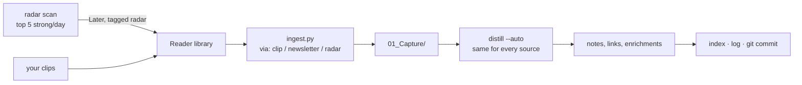

# One pipeline (R11)

The radar (R10) promoted feed items into Reader's Later list; the readwise ingest treats Later as
"the owner saved it" and must never drop a save. Two pipelines that met by accident. Mike's call,
2026-09-23: **one pipeline, different sources; the owner's clips never drop and get enhanced; the
distilling, connecting and enriching is the same for everything; it runs automatically, often;
the vault is the memory of every agent.**

- **Sources** differ only in `via`, which decides one thing: a `clip` always becomes a note or an
  enrichment; `radar` and `newsletter` captures may be retired without one when triage says
  discard (`distill_judge.apply_provenance`).
- **Unattended** (Mike: OK): `distill --auto`, gated by `distill_check`; a capture that fails twice
  is parked with a DLQ note; every run ends in one vault commit, the undo.
- **Cadence** (Mike: yes): every 3 hours, at most 10 captures a run, clips first; the radar
  promotes at most 5 items a day.
- **Pieces**: `radar.py scan --promote` (daily cap), `readwise/scripts/ingest.py` (was agent
  markdown), `obsidian/scripts/pipeline_run.py` (lock, queue, index, log, commit) and the
  `obsidian:pipeline` skill that runs them in order.
