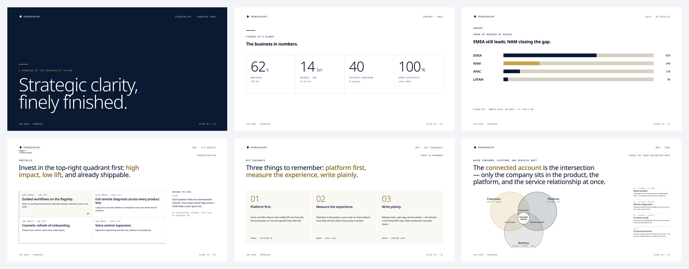
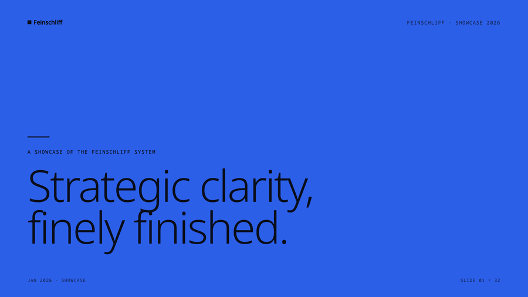
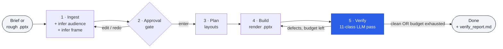

# feinschliff

> *Feinschliff* — German for "fine polish." Brand-pluggable design system that turns Claude Design HTML into brand-perfect PowerPoint decks. Ships with the eponymous `feinschliff` brand pack (indigo + Noto Sans, MIT). Bring your own brand by dropping in a `tokens.json` and a Claude Design HTML.



## What it does

Three Claude Code skills:

- **`/deck`** — create or polish a brand-compliant `.pptx` from a brief or rough deck. Theory-aware: infers audience and narrative frame, applies anti-pattern rules, runs an 11-class verify pass before declaring done.
  - `/deck "content brief"` — new deck from a brief
  - `/deck polish rough.pptx` — reflow an existing deck into brand layouts
  - `/deck critique existing.pptx` — read-only defect analysis

- **`/extend`** — add a new component or layout to the active Baukasten from a screenshot. Additive — never modifies existing layouts.

- **`/compile`** — rebuild the catalog and renderer code when the Claude Design HTML reference changes.

The active brand is resolved via `FEINSCHLIFF_BRAND` env-var (default: `feinschliff`) or `--brand <name>` flag.



## How it works

Five phases, one approval gate, one verify-iterate loop:



The verify pass runs **11 defect classes** in parallel — five visual (overflow, empty placeholder, layout mismatch, brand violation, density) and six rhetorical (claim-title, one-idea, bullet-dump, audience-mismatch, red-line-break, curse-of-knowledge). The deck only ships when all eleven are green, or when the iteration budget exhausts (3 default / 6 perfectionist) and the user approves the remaining defects.

📖 **Full walkthrough with all diagrams:** [`docs/architecture.md`](docs/architecture.md) — every phase, the 11 verify classes explained, the iteration budget mechanic, and how `/extend` and `/compile` fit in.

## Quick start

```bash
# Install via the marsmike/agentic-toolkit marketplace
/plugin marketplace add marsmike/agentic-toolkit

# Use the default feinschliff brand
/deck "Q1 update: 12 launches, 3 customers, $4.2M ARR"
```

Or build the brand template directly:

```bash
cd feinschliff/brands/feinschliff/renderers/pptx
uv sync
uv run python build.py
# → out/Feinschliff-Template.pptx
```

## Brand pack (v0.1)

| Pack | License | Description |
|---|---|---|
| `feinschliff` (default) | MIT | Indigo palette + Noto Sans. The pack is the eponymous default — author your own brand pack alongside it by following [`references/brand-pack-spec.md`](references/brand-pack-spec.md). |

## Renderers

Each brand pack ships up to four renderer formats:

| Renderer | Purpose |
|---|---|
| `pptx/` | PowerPoint template + decks. Named layouts with typed placeholders. |
| `excalidraw/` | `apply_<brand>()` theme + DSL palette mapping. Palette loaded from `tokens.json`. |
| `remotion/` | `<brand>-theme.md` recipe — Remotion `theme.ts` tokens + components. Drift-guarded by test. |
| `svg/` | SVG renderer — 1920×1080 static output for web embeds, status pages, dashboards. |

All renderers read `tokens.json` + `catalog/*` from the active brand pack. No renderer imports another.

## Bring your own brand

Brand packs follow a small contract — see [`references/brand-pack-spec.md`](references/brand-pack-spec.md). The fastest way:

```bash
cp -R feinschliff/brands/feinschliff feinschliff/brands/myco
# Edit tokens.json, claude-design/, optionally logo/
FEINSCHLIFF_BRAND=myco /deck "..."
```

Then add a smoke test at `feinschliff/tests/test_myco_brand_pack.py` (mirror the feinschliff template).

## Structure

```
feinschliff/
├── brands/
│   ├── feinschliff/                   MIT — eponymous default
│   │   ├── tokens.json                DTCG draft-2 design tokens
│   │   ├── claude-design/             HTML reference + assets
│   │   ├── catalog/layouts.json       layouts with tool schemas
│   │   └── renderers/
│   │       ├── pptx/                  Baukasten Python; run build.py
│   │       ├── excalidraw/            apply_feinschliff() + palette mapping
│   │       ├── remotion/              feinschliff-theme.md (theme.ts recipe)
│   │       └── svg/                   theme + primitives + layouts
│   ├── claude/                        derived from getdesign.md/claude
│   ├── spotify/                       derived from getdesign.md/spotify (reference pack)
│   ├── bmw/                           derived from getdesign.md/bmw (reference pack)
│   ├── binance/                       derived from getdesign.md/binance
│   └── ferrari/                       derived from getdesign.md/ferrari
├── examples/                          pre-rendered PDF previews + plugin demos
│   ├── feinschliff/                   eponymous brand preview
│   ├── claude/   spotify/   bmw/      one folder per brand pack
│   ├── binance/  ferrari/             — click the .pdf to view inline
│   ├── brief-to-deck/                 /deck command demo
│   └── design-md-to-tokens/           /compile command demo
├── skills/
│   ├── compile/SKILL.md               /compile
│   ├── extend/SKILL.md                /extend
│   └── deck/SKILL.md                  /deck
├── references/
│   ├── brand-pack-spec.md             authoring contract for new brand packs
│   ├── renderer-protocol.md           adding a new renderer format
│   └── claude-design-prompt.md        authoring Claude Design HTML
├── tests/                             pytest: per-brand smoke tests
├── README.md
└── NOTICE.md                          third-party attribution
```

## What this is NOT

- Not a SaaS — runs locally; no account, no telemetry, no cloud rendering.
- Not a slide editor — feinschliff generates `.pptx` files; edit them in PowerPoint, Keynote, or Google Slides.
- Not married to any specific brand — the eponymous default exists so the system has a brand to demonstrate against; bring your own.
- Not a replacement for design judgment — `/deck` enforces brand and runs an 11-class verify pass, but the narrative and content still need a human author.
- Not built for hand-tweaking individual shapes — the model is "compose from layouts," not "free-form canvas."

## FAQ

**Do I need an Anthropic API key?**
You need Claude Code installed and authenticated. The plugin runs through Claude Code's skill system; no separate API key.

**Can I use this without Claude Code?**
The Python renderer (`build.py`) runs standalone and produces `.pptx` files from a brand pack. The `/deck`, `/extend`, `/compile` skill workflows are Claude Code-specific.

**Why is it called *Feinschliff*?**
German for "fine polish" — the last 10% of brand-compliance work that usually gets dropped under deadline. The plugin automates that step.

**Can I add my own brand?**
Yes — that's the point. `cp -R feinschliff/brands/feinschliff feinschliff/brands/myco`, edit `tokens.json` and the Claude Design HTML, set `FEINSCHLIFF_BRAND=myco`. See [`references/brand-pack-spec.md`](references/brand-pack-spec.md).

**Why not just use Marp / Slidev / Tome / Beautiful AI?**
See the comparison below — feinschliff's wedge is `.pptx` output, brand-pluggable token systems, and an 11-class verify pass that catches both visual and rhetorical defects.

**How do I report a bug?**
[Open an issue](https://github.com/marsmike/agentic-toolkit/issues/new/choose) — the bug-report template walks you through the required info.

## Compared to alternatives

| Tool | Output format | Brand-pluggable | Theory checks | Open source |
|---|---|---|---|---|
| **feinschliff** | `.pptx` (native PowerPoint) | yes — token-driven brand packs | 11-class verify (visual + rhetorical) | MIT |
| Marp | `.html` / `.pdf` / `.pptx` | CSS theme | none | MIT |
| Slidev | `.html` / `.pdf` | Vue/CSS | none | MIT |
| Beautiful AI | proprietary | template chooser | none | proprietary SaaS |
| Tome | proprietary | template chooser | none | proprietary SaaS |
| Gamma | proprietary | template chooser | none | proprietary SaaS |

The wedge is the combination: **`.pptx` users actually edit + brand-pluggable token system + verify pass that catches one-idea-per-slide / claim-title / curse-of-knowledge violations, not just visual overflow.**

## Roadmap

- [x] **v0.1.0** — `feinschliff` brand pack, three skills, MIT.
- [x] **v0.1.x** — six brand packs ship pre-rendered PDFs in [`examples/`](examples/) (Feinschliff, Claude, Spotify, Binance, BMW, Ferrari). BMW + Spotify are reference packs with brand-policy blocks (cover / section-marker / photography / headline-rule / chip-rule / shadow) read by a shared `add_rounded_rect` primitive — pill / sharp / rounded geometry flips by editing tokens, never the renderer.
- [ ] **v0.2** — accept any `DESIGN.md` from [VoltAgent/awesome-design-md](https://github.com/VoltAgent/awesome-design-md) (34k★, 76 design systems) as direct brand-pack input. Stripe, Vercel, Linear, Notion, Spotify, etc., one drop-in.
- [ ] **v0.3** — converge the per-brand renderer forks into one shared `feinschliff/engine/`. Each brand pack collapses to `tokens.json` + `chrome.py`, no more 96-file forks.
- [ ] **v0.4** — pluggable verify-pass rule library; users add their own defect classes.
- [ ] **v0.5** — Remotion + SVG renderer parity (today's parity is partial — pptx is the main path).
- [ ] **v1.0** — first feedback-driven major; API stability commitment.

## License & attribution

MIT — see repo root `LICENSE`. Third-party attribution: [`NOTICE.md`](NOTICE.md).

## References

- [`docs/architecture.md`](docs/architecture.md) — full pipeline walkthrough with diagrams (`/deck`, `/extend`, `/compile`).
- [`references/brand-pack-spec.md`](references/brand-pack-spec.md) — contract for authoring a new brand pack.
- [`references/renderer-protocol.md`](references/renderer-protocol.md) — how to add a new renderer format.
- [`references/claude-design-prompt.md`](references/claude-design-prompt.md) — how to author Claude Design HTML for Feinschliff.
