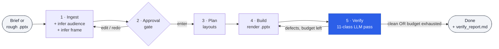
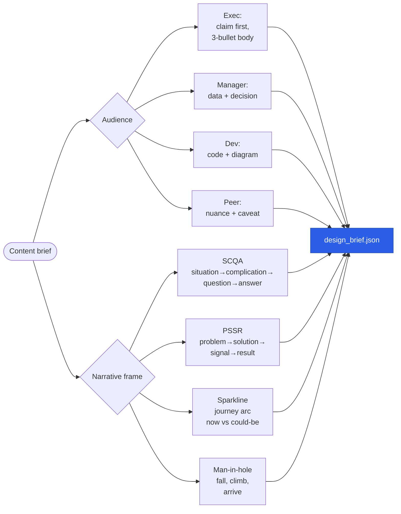
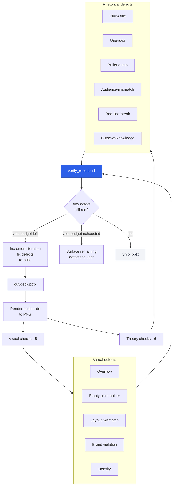
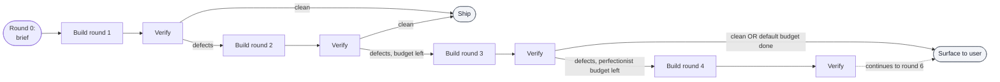
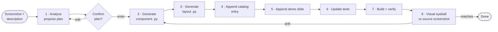

# How feinschliff works

A walkthrough of what happens when you type `/deck "..."`. Each phase produces a concrete artifact you can inspect, edit, or interrupt.

## Pipeline at a glance



Five phases, one approval gate, one verify-iterate loop. The user can interrupt at any phase; only the verify pass is mandatory before declaring "done."

## Phase 1 — Ingest

Reads the input (a brief, an outline, or an existing `.pptx` to polish) and produces two structured artifacts:

- **`content_plan.json`** — what the deck says. Tagline, slide-by-slide claims, supporting evidence.
- **`design_brief.json`** — how the deck should land. Inferred audience, narrative frame, perfection budget, anti-patterns to avoid.

The *audience* and *narrative frame* are inferred up-front because they shape every downstream choice — which layouts to use, what voice rules apply, which defect classes to weight more heavily in verify.



The audience choice (exec / manager / dev / peer) drives slot caps (an exec slide gets fewer bullets, larger type), voice tone, and which anti-patterns are flagged hardest. The narrative frame drives slide ordering and which layouts are picked at the chapter / section transitions.

## Phase 2 — Approval gate

Before any rendering happens, the inferred `design_brief.json` and `content_plan.json` are presented as a one-screen summary. Three options:

- **`enter`** — proceed with what was inferred.
- **`edit`** — change a specific field (audience, frame, slide count, perfection budget) and re-emit the brief.
- **`redo`** — re-run ingest with a different reading of the input.

The gate exists so the model's interpretation is *visible and overridable* before expensive rendering happens. It's the cheapest place to correct a mistake.

## Phase 3 — Plan layouts

Walks the content plan slide-by-slide and picks a layout for each one. The mapping is *concept → layout*:

| Concept | Likely layouts |
|---|---|
| Section opener | `chapter-accent`, `chapter-ink` |
| KPIs / metrics | `kpi-grid`, `bignum`, `bar-chart` |
| Multi-option comparison | `two-column-cards`, `four-column-cards` |
| Process or sequence | `numbered-process`, `agenda` |
| Quote / testimonial | `quote` |
| Architecture / diagram | `text-picture`, `full-bleed-cover` |
| Final CTA | `end` |

The pick is informed by the catalog's `slot` definitions — a layout offering 4 slots is wrong for a 7-bullet idea (forces a bullet-dump anti-pattern). Result: `deck_plan.json` — the per-slide layout choice plus the populated slot values.

## Phase 4 — Build

Renders `deck_plan.json` through the active brand's Baukasten:

- Resolves the active brand via `FEINSCHLIFF_BRAND` (default: `feinschliff`).
- Loads `brands/<brand>/tokens.json` for color and typography.
- Loads `brands/<brand>/catalog/layouts.json` for slot definitions.
- Calls per-layout Python in `brands/<brand>/renderers/pptx/layouts/` to build each slide.
- Emits `out/<deckname>.pptx`.

Renderers are intentionally brand-agnostic in code — they consume tokens, never hardcode colors or fonts. Swapping brand packs is purely a `tokens.json` change for most layouts.

## Phase 5 — Verify (mandatory, never skipped)

The verify pass is the part that turns an LLM-generated deck into something you'd actually present. It runs in two parallel tracks:



### The 11 defect classes

**Visual (5)** — what's wrong with the picture:

| Class | What it catches |
|---|---|
| **Overflow** | Text or content exceeds its placeholder bounds |
| **Empty placeholder** | Layout has a `_NN` slot that didn't get filled |
| **Layout mismatch** | The chosen layout doesn't fit the content shape (4-slot layout, 7 bullets) |
| **Brand violation** | Wrong colors, wrong fonts, off-grid spacing |
| **Density** | Too much on one slide; reader can't parse in 8 seconds |

**Rhetorical (6)** — what's wrong with the argument:

| Class | What it catches |
|---|---|
| **Claim-title** | Title is a topic ("Q1 Update") instead of a claim ("Q1 hit plan despite churn") |
| **One-idea** | Slide tries to argue two distinct points; should be split |
| **Bullet-dump** | Five+ bullets with no internal hierarchy or progression |
| **Audience-mismatch** | Voice / detail level doesn't match the inferred audience |
| **Red-line-break** | The narrative arc breaks between slides; reader loses the thread |
| **Curse-of-knowledge** | Assumes context the audience doesn't have; un-explained jargon |

A slide passes verify only when **all 11 classes are green**. The verify report (`out/verify_report.md`) lists every defect with the slide index, defect class, and a one-line fix recommendation.

### Iteration budget

The user picks the budget at the start (Phase 0):

- **Default — 3 iterations.** Suitable for 80% of decks; passes verify cleanly on round 2 or 3.
- **Perfectionist — 6 iterations.** For decks where every slide matters (board, customer, exec).

If the budget exhausts before verify is fully green, the remaining defects are surfaced to the user with the deck — they decide whether to ship or extend the budget. The plugin never silently ships a defective deck and claims it's done.



## What you get when it's done

```
out/
├── <deckname>.pptx           ← the deliverable
├── verify_report.md          ← human-readable defect log per slide per class
├── design_brief.json         ← captured audience + frame for reproduction
├── content_plan.json         ← what every slide says
└── deck_plan.json            ← which layouts were picked and why
```

The intermediate JSON files are intentional — they let you re-run verify later (after manual tweaks), share the brief with a teammate, or re-build the same deck with a different brand pack via `FEINSCHLIFF_BRAND=othercompany`.

## Where this is implemented

- **Pipeline orchestration:** [`skills/deck/SKILL.md`](../skills/deck/SKILL.md) and its references.
- **Audience + frame inference:** [`skills/deck/references/audience-calibration.md`](../skills/deck/references/audience-calibration.md), [`skills/deck/references/narrative-frames.md`](../skills/deck/references/narrative-frames.md).
- **Layout selection:** [`skills/deck/references/visual-vocabulary.md`](../skills/deck/references/visual-vocabulary.md).
- **Verify rules:** [`skills/deck/references/iteration-loop.md`](../skills/deck/references/iteration-loop.md), [`skills/deck/references/anti-patterns.md`](../skills/deck/references/anti-patterns.md), [`skills/deck/references/slide-claim-test.md`](../skills/deck/references/slide-claim-test.md).
- **Brand-pack contract:** [`references/brand-pack-spec.md`](../references/brand-pack-spec.md).
- **Renderer protocol:** [`references/renderer-protocol.md`](../references/renderer-protocol.md).

## Sister skills

`/deck` is the most complex skill. The other two are simpler:

- **`/extend`** — additive Baukasten extension. User shows a screenshot + describes intent, plugin generates a new component + layout + catalog entry. Visualised below.



- **`/compile`** — when the brand's HTML reference changes, regenerates the catalog and layout stubs. Drift-check first, then parse, then emit. Read [`skills/compile/SKILL.md`](../skills/compile/SKILL.md) for the pipeline.

## Why this design

Three commitments shape the architecture:

1. **The verify pass is mandatory.** Without it, an LLM-generated deck is a guess. With it, every claim about the deck's quality is testable. The 11 classes were chosen because they correspond to defects that *cost the speaker credibility* in front of the audience — visual or rhetorical, both equally fatal.
2. **Audience and frame are inferred up front.** Layout selection without an audience is just decoration. Layout selection with an audience becomes "is this the right shape for *this* viewer?"
3. **Brand is pluggable, never hardcoded.** Every renderer reads `tokens.json`. Every voice rule reads from the brand pack's content rules. Swapping `FEINSCHLIFF_BRAND` is the only thing needed to retarget.

The trade-off: every deck takes 30–90 seconds even on the default budget because verify runs the LLM-eyeball over every PNG. That's slower than naive layout-picking. It's also the reason the deck is shippable when it's done.
