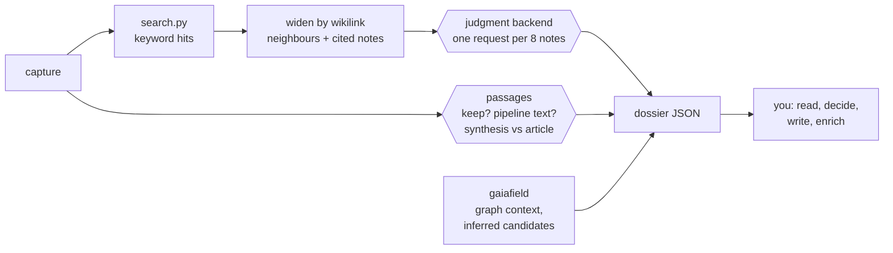
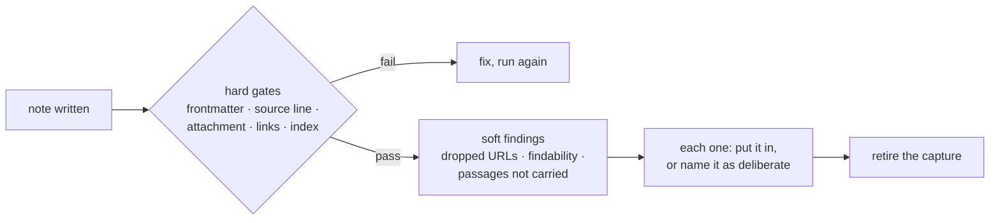

# Reading the dossier

`distill_judge.py <capture> --dossier --json` prints one block per capture. Every number in
it comes from a typed-judgment backend (see [[Typed-Judgments]] in the vault) and is
advice; the block is labelled `advisory` with its backend, model and `questions_version`.

**Read it without writing code.** Leave out `--json` and the same run prints the summary per
capture (triage, mode, placement, related notes with levels) and the batch's cluster pairs. With
`--json` the top level is `{"captures": [ {"capture": "<path>", "triage": …,
"already_distilled": …, "placement": …, "related": […], …}, … ], "batch": {"cluster": […]},
"usd": …}`: `captures` is a **list**, each block names its capture in `"capture"`.
[earned: 2026-09-23, a pipeline run's own summary script read `captures` as a dict and failed]

| Field | What it says | How to read it |
|---|---|---|
| `content` | `verdict` ok / stub / wrong-page, with `p`; `source` frontmatter (no model call, `content: stub` from ingest) or `judged`; `note` | read this **before** `triage`: when it isn't `ok`, the triage score above judged this same wrong text, not the article — ignore it, and distill from the source instead (SKILL.md, "A stub is not the content") |
| `triage.recommendation` | distill / quick-file / discard-candidate / none | a discard is only ever a candidate, and a clip is never one (it reads quick-file); meaningless when `content` isn't `ok` |
| `provenance` | `via`: clip (the owner saved it; also any capture without `via`), newsletter, radar (with `radar_interests`); `owner_chose_it` | the only thing it changes is whether the capture may leave without a note; a radar capture's interests say why it was promoted |
| `already_distilled` | `canonical_by_url`: a note whose `source:` is this capture's own source; `covers`: notes judged to already document the same original work, or the same named tool/project/paper/product, under another address; `suggested_mode` new-note / enrich-only / hybrid | a canonical hit is provenance, decided without the model; a `covers` hit — same tool documented from its docs page vs. an announcement tweet counts — means enrich that note, do not duplicate it |
| `related[]` | per candidate note: `p_relevant` (same subject), `p_principle` (same idea in another field; `bridge` when it alone selects the row), `relation` and `suggested_level` (L1/L2/L3), `p_covers`, `url_hit`, `via` (the search hit it was reached through) | a candidate list, not a ceiling; open what is judged relevant, read past the top of the raw search output too. When `search.note` says farsight, `judged_relevant` is the enrichment gate; otherwise the score gate stands and this is a second opinion. L2/L3 still need the sentence you can cite |
| `placement` | folder, `ambiguous`, `alternatives` (a runner-up holding real mass) | `ambiguous` means follow rules.md and, if it stays 50/50, the DLQ |
| `domains` | domains the capture is mainly about | tags |
| `passages` | `essence_text`: the paragraphs that carry a claim, number, mechanism or example; `summary_relation` faithful / adds_framing / overstates / misstates; `p_reverses` | read the essence first; never quote the pipeline's synthesis as the source when it `overstates` or `misstates` |
| `graph` | backlink candidates and bridge opportunities from the wikilink graph; `inferred` rows with an `adjudication` | report-only; AMBIGUOUS rows appear only on request |
| `cluster` (batch) | per pair: `duplicate` (same source or near-identical text, no model), `merge-candidate` (one adds nothing over the other), `distinct` | a duplicate needs one note; a merge candidate needs you to name what each adds |

A note per capture that has specifics, a hub for the shared principle (rules.md, Cluster
mode). Then the check:

Two things the check cannot see and you must: whether the note says something true and
useful in your own words rather than restating, and whether an enrichment you made in
another note reads as if it always belonged there.

## Graph availability

`graph.available()` looks in the toolkit's engine directory (`~/.local/share/agentic-toolkit/bin`),
not only on PATH. [earned: 2026-09-22 — an agent skipped graph context for eight captures because
`which gaiafield` found nothing while the binary was installed]

## When something is genuinely unresolvable

A search that returns nothing for a query that plainly should match, a source that cannot be
recovered, a placement that stays 50/50 after one honest attempt: write a dead-letter note
(`vault_utils.write_dlq_note()`, or by hand under `00_Memory/dlq/`) and say so in the
handoff. A run that guessed looks identical from the outside to one that got it right.
