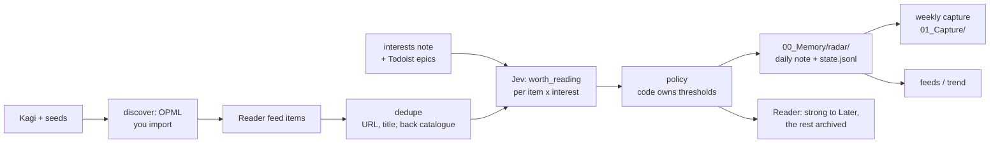
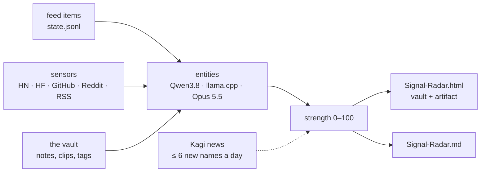

# radar plugin

Reads everything Reader aggregates, judges every feed item against your interests with typed
judgments, and puts the result where you already look: a daily note in `00_Memory/radar/`, a
weekly capture in `01_Capture/`, strong items in Reader's Later list. It also says which feeds
earn their place and proposes new ones. The clip stays yours; the pipeline behind it is unchanged.

## Commands

`scripts/radar.py` (run with `uv run --project plugins/radar/scripts python3 plugins/radar/scripts/radar.py …`):

| Command | What it does | Network |
|---|---|---|
| `scan --since 1d [--promote] [--keep-in-feed]` | judge new feed items, write the day's note and state, archive what was recorded (strong items to Later with `--promote`) | Reader, judgment backend |
| `weekly [--week YYYY-Www] [--force]` | `01_Capture/Radar-Week-…md`, a draft digest for distill | none |
| `feeds` | per-feed yield; "consider unsubscribing", "serves only <interest>" | none |
| `trend [--week]` | interests rising above their baseline; emerging title terms (experimental) | none |
| `discover [--interest ID] [--seed URL] [--queries N]` | candidate feeds from Kagi, URL shapes, autodiscovery and hnrss, validated and judged, as an OPML | Kagi, Reader (read), the candidate sites, judgment backend |
| `gaps [--promote]` | once a week: recent posts per interest the feeds missed (Kagi news), judged; strong ones in the digest, optionally saved to Later | Kagi, judgment backend, Reader (save) |
| `kagi search\|news\|answer\|summarize TEXT` | the kagi skill: one Kagi call under the ledger and weekly budget | Kagi |
| `sensors [--only SOURCE]` | pull momentum sources Reader does not carry — Hacker News, Hugging Face trending, new GitHub repos, Reddit with scores, RSS — into `00_Memory/radar/sensors/`, new items judged | HN Algolia, Hugging Face, GitHub, Reddit, feed hosts, judgment backend |
| `signal [--kagi]` | the Signal Radar: named things across feed, sensors and the vault, each with a signal strength; writes `Signal-Radar.html`, `.md` and `signal.json` | Kagi news with `--kagi` (≤ 6 names a day) |
| `replay --since 30d --out DIR` | acceptance: own clips vs. feed items, Jev vs. BM25 vs. recency | Reader (read), judgment backend |

The skill (`skills/radar/`) turns the daily and weekly runs into a short briefing;
`skills/radar/references/scheduling.md` sets them up as scheduled tasks.

## Signal Radar

The scan answers "is this worth reading for me"; the Signal Radar answers "what is taking off".

- **Entities** (`entities.py`): spans of name-like words in a title (a digit, an inner capital, a
  dot between letters), with the address winning where it names the thing exactly (a GitHub repo,
  a Hugging Face model family). `Qwen 3.8`, `Qwen3.8-27B` and `unsloth/Qwen3.8-GGUF` join as `qwen38`.
- **Strength** (`signal_radar.py`): 25 % breadth (independent source families in the last week),
  20 % velocity (the last three days against the fourteen before), 20 % engagement (the best
  percentile within its source and day), 15 % relevance (the judge's best p), 15 % volume, 5 % the
  vault. Stages: `new` (first seen in the last three days), `hot` (≥ 70), `rising` (twice the
  baseline rate), `fading` (nothing in three days), `steady`.
- **Early warning**: first seen in the last 72 h and already in two families, or top-decile
  engagement. **Blind spots**: strength ≥ 55 and nothing in the vault.
- **The vault as a source** (`vault_pulse.py`): notes and clips per day, this week against the
  four before, and the tags that are rising or new in the owner's own writing. A note's tags count
  toward an outside entity of the same name, so "you already have it" shows on the blip.
- **Where it lands**: `00_Memory/radar/Signal-Radar.html` (one self-contained page, no network),
  `Signal-Radar.md` for reading in Obsidian, `signal.json`. The cloud run republishes the page to
  the artifact the profile's `signal_artifact_url` names.

## What it measured before shipping

The R10 acceptance run on a real Reader account (30 days, 1,325 feed items plus 24 own clips):

- Same-day AUC of own clips against feed items: **Jev 0.70, BM25 0.57, recency 0.47**. At a
  budget of 20 items a day, 71% of the clips would have been shown (BM25: 50%).
- 1,325 feed items → 194 worth reading, 102 strong (about 4 strong a day), for $0.10.
- A blind audit of 120 stratified items (labelled by a model that never saw p): the strong band
  held at 69%, the 0.60–0.80 band at 23%, which moved `T_WORTH` to 0.70.
- Feed yield: 101 of 102 strong items came from arXiv; three embedded-systems feeds produced none
  in a month. That is what `feeds` and `discover` are for.

## Configuration

`profile.example.md` documents every profile key and exactly what leaves the machine. Keys come
from the environment or the key file `~/.env`, read by each script itself (`READWISE_TOKEN`, `KAGI_API_KEY`, `TOOLKIT_RADAR_JUDGMENT_API_KEY` or
`OPENROUTER_API_KEY`); without one, the command that needs it prints `SKIPPED` and sends nothing.

## Boundaries

- No cross-plugin imports: `judge.py`, `judgments/urls.py` and `judgments/state.py` are
  byte-identical copies of the obsidian plugin's, held together by a parity test in
  `core/tests/test_contract.py`.
- Reader writes go through one guarded `bulk_update`: location (archive, later, shortlist, new),
  tags and notes only. Never a delete, never back into the feed.
- Writes into the vault: `00_Memory/radar/` (scan, discover, sensors, signal) and `01_Capture/` (weekly). Nothing
  in `02_`–`04_`.
- Evals (`evals/run.py`): scan, replay, discover and reports, offline with stubbed network, against
  a sandbox copy of `./vault`; registered in CI.

## Not yet

Nothing from the R10 plan is left unbuilt. Since the first release: `gaps` (once a week, Kagi's
recent-posts index per interest, judged; strong finds in the weekly digest and, with `--promote`,
saved to Later within the daily budget), the `kagi` skill (search, news, FastGPT answers, the
Universal Summarizer, one ledger and budget), and `scan --todoist` (one dated comment a day on each
Portfolio epic with strong items, never a new or completed task). Reader has no feed-subscription API, so `discover` ends in an OPML, not a subscription.
