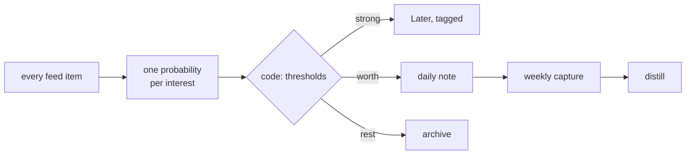

# Active Radar

> [!summary] In one breath
> Everything after a clip was already automated; the clip itself was "I stumble over a link".
> An active radar asks a typed judgment about *every* aggregated item, per interest, and lets
> code decide what reaches you. The feed gets read in full without you reading it.

Subscriptions pile up faster than anyone reads them. On the real account the radar was built
for, a month of feeds held about 1,700 items, none ever opened, while every clip that month came
from somewhere else. The feed was not noise: it was unread. The fix is not a better feed but a
reader that never tires, asking the same narrow question of each item that [[Typed-Judgments]]
ask of captures: *would someone working on this interest want to read this, this week?*

Three things make it trustworthy rather than another ranking:

- **It is measured against what you already do.** Your own clips are the positives, the feed the
  negatives; the judgment ships only if it beats a keyword baseline on items from the same day.
  Pooling across days lets a batch import pass for a signal — the lesson recorded in
  [[Calibration-Bias]] applies to time as much as to cluster size.
- **Thresholds are code and move on evidence.** A blind audit decides where the "worth" band
  starts, not how a morning's list looks.
- **It curates its own inputs.** Per-feed yield says which subscriptions never produce anything
  strong; discovery proposes feeds with a stated reason, and a human subscribes.

What it deliberately does not do: clip for you, write into active notes, or delete anything in
the reader. Its output enters the vault the way everything else does, as a capture that
a person reviews during [[Two-Phase-Distillation|distill]].

*Source: toolkit design work (R10, `plugins/radar`).*

## Related

- [[Typed-Judgments]] — the primitive the radar applies to feed items
- [[Calibration-Bias]] — why the acceptance metric compares items from the same day
- [[Two-Phase-Distillation]] — the checkpoint the weekly capture passes through
