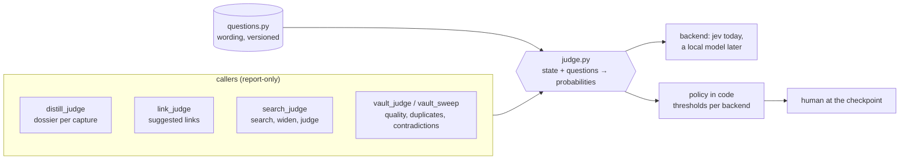
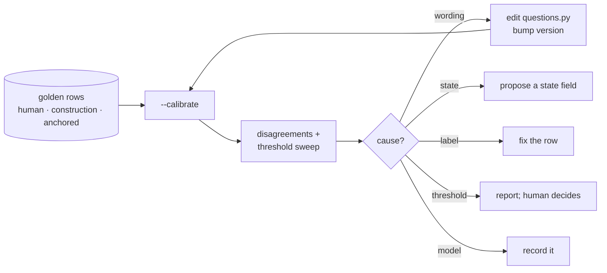

# Typed Judgments

> [!summary] In one breath
> Ask a small model many narrow yes/no and pick-one questions about your notes, get a
> probability for each, and keep every threshold and every consequence in code. The model
> supplies numbers; the vault's rules decide what they mean; a person decides what happens.

Most of what a distill run has to decide is small: is this found note about the same mechanism
or does it only share vocabulary, does the capture extend a passage or merely sit next to it,
which folder, does this capture add anything its sibling lacks. A frontier model can decide all
of that by reading prose rules, and it did, once per capture, with nothing to show for how sure
it was. A similarity score could decide some of it, until the score stopped meaning anything:
once [[Farsight]] supplied raw BM25 scores, the 0.70 enrichment gate became "informational
only" (see [[Semantic-Search-Score-Calibration]]).

A **typed judgment** is the third option. One request carries a shared `state` (the capture,
the found notes) and a dictionary of narrow questions; each comes back as a probability, never
as text. `plugins/obsidian/scripts/judge.py` is the seam, `distill_judge.py` the first caller.

## The division of labor

- **The model supplies the number.** One judgment per question, worded so a high value means
  yes, with criteria that describe concrete situations and always a way to say "none of these".
- **Code owns the policy.** Thresholds, gates and what a number leads to live in the calling
  script, per backend. A number tuned on a calibrated model does not transfer to an
  uncalibrated one, the same lesson as [[Calibration-Bias]] one layer up.
- **Wording is data.** Every question lives in `scripts/judgments/questions.py` with a
  `QUESTIONS_VERSION`; every emitted block carries backend, model and that version.
- **Narrow heads, never a holistic one.** "Is this capture good?" averages the signal away;
  "does `notes.N03` discuss the same mechanism?" separates.
- **Advice, not action.** A judgment is report-only under the same rule as an inferred edge
  ([[Inference-Write-Policy|Report-Only Inference]]). It reaches the human through the distill
  run's Phase 1 handoff, where the frontier model also says where it disagrees.

## Who tunes whom

The cheap model answers; the reasoning model writes and debugs the questions. When an answer is
wrong, the first suspect is the question, then the state, then the label, and only then the
model: see the judgment-calibration loop (`docs/MAINTAINING.md`), which classifies every disagreement by cause before
proposing the smallest fix, keeps a held-out slice away from the tuning step, and never accepts
a backend's own answer as a label.

## Calibration log

- **2026-09-21, jev-1.13, questions .1 → .2.** First run on the three bundled captures: 30/35
  tune, 9/10 held out. Three of five misses shared one cause: the captures carry collector's
  remarks ("raw, not yet distilled", "check overlap before distilling"), so the relevance and
  relation questions linked them to [[Capture-Conventions]]. Cause class: *question read too
  broadly*. Fix: judge "the subject matter of `capture`", and name collection/processing
  overlap in the false criterion. After: 31/35 tune, held out unchanged, the false relevance
  gone and the false "strengthens" probability down from 0.76 to 0.40. Thresholds untouched;
  the relevance sweep suggests 0.60 over 0.50 but 13 rows do not justify a policy change.
- **2026-09-22, jev-1.13, questions 2026-09-22.1, link adjudication.** First wording of the
  link question ("same underlying mechanism … so that a reader should be pointed to the other")
  scored 20 author-made links at a mean of 0.24 and rejected 16. Cause class: *question too
  narrow for the policy it serves* — an author links notes that draw on each other, not only
  notes about one idea. A broader wording ("would a link help a reader, because one genuinely
  draws on the other") moved them to 0.75 with unlinked cross-cluster pairs at 0.15 (AUC 0.99,
  held-out split 1.0). The narrow wording was kept as a second number because it is the better
  *ranker* of [[Gaiafield]]'s own suggestions: AUC 0.95 against two blind annotations, cosine
  0.75. Its scale is compressed (real matches at 0.10-0.30), so it is read against its own low
  cut and only once the broad probability clears a floor: ranking transfers, thresholds do
  not. Three single-condition rewordings ranked no better and were dropped.
- **2026-09-22, stability.** The same pair asked again moves by 0.02-0.04. Asked with the two
  notes swapped it moves by 0.08-0.10 on average and up to 0.4-0.5, enough to flip a third of
  the labels. One pair per request shows the same swing as forty, so it is an order effect,
  not cross-talk between pairs. Cause class: *none of the five; a property of the backend*.
  Mitigation is code, not wording: every pair is asked in both orders and averaged, the gap is
  reported as `order_gap`, and a gap of 0.30 or more reads UNDECIDED whatever the average says.
  After averaging: 11 of 70 gaiafield suggestions read LIKELY-LINK (8 real, base rate 16%), 16 read
  LIKELY-NOISE (0 real). The per-capture distill questions were checked the same way: rerun drift 0.008, and
  asking twice with the candidates reversed changed nothing (54/60 vs 55/60), so they stay at
  one request; treat any answer within 0.1 of a cut as undecided.
- **2026-09-22, distill golden set 45 → 68 rows.** Eight fixture captures with answers known by
  construction. 50/54 tune, 13/14 held out. New miss is a threshold (same-source 0.68 vs a 0.80
  cut), reported for a human decision, not changed.
- **2026-09-22, questions .2, retrieval.** Twelve questions in a reader's words, one known
  answer each. Keyword search: 5 first, 3 never found. Rerank of the top ten by "would
  opening this give the asker what they wanted": 9 first. A Jev-driven graph walk (Choice over
  outgoing links, Noul "goal reached", beam 3, 4 hops): 4 first, 5 s and 3× the cost, dropped.
  Its one useful observation: every note search missed was one wikilink from a note it found.
  Widening the candidates by the top hits' neighbours (deterministic, free) and reranking once:
  **11 first, 12 found**, 0.7 s, $0.0006. Lesson, same as the extraction pipelines report: the
  judge is only as good as its candidate list, and the graph is a second candidate generator
  that costs nothing.
- **2026-09-22, questions .3, replay on a real vault.** Three archived captures re-distilled
  with their old notes hidden, then judged blind against the old notes by a careful editor.
  Preservation: 9/9 vs 9/9 in every case, so the writing is Claude's and the judgments
  change nothing there. Linking decided all three: new wins two (9 vs 6, 8 vs 6; and it
  caught a same-source duplicate the old run had created), old wins one (9 vs 4). The lost
  case's good links were principle-level bridges (Observability, Self-Preference-Bias,
  Representation-Steering) that share no vocabulary with the capture: search never proposed
  them, gaiafield's static embeddings proposed five candidates that were all noise, and the
  old run had them only because it distilled a batch together. Two causes fixed in code:
  the capture query carried Readwise header boilerplate (stripped), and the relevance
  question was topic-bound, scoring those bridges at 0.36-0.52 while a "same underlying
  principle, even in another field" wording scores them 0.61-0.71 and non-links 0.33-0.45;
  it is now a second channel (`p_principle`, rows it alone selects marked `bridge`). The
  cause left open is candidate generation: nothing in the stack proposes a cross-domain
  bridge for a fresh capture, and a judge cannot select what is not on the list.
- **2026-09-22, findability.** Nine recall questions written from the captures alone, in a
  reader's words: old notes found 7/9, new notes 5/9, plain search 6/9 and 5/9. Two of three
  questions about one note found nothing under BM25, under BM25 plus bge-micro, and with
  thirty candidates, although the note held every claim. Cause: the note's own words versus
  the reader's. The lever is at write time, so the workflow gained a findability check
  (step 7b): ask the questions you would type a year from now, and put those words in the
  description, which search weights twice.
- **2026-09-22, questions .4, maintenance.** Passages: a Noul "is the synthesis faithful"
  scored every real Readwise synthesis 0.3-0.5, because a synthesis adds framing by design;
  cause class *question too strict for the policy*. Replaced by a four-way Choice (faithful /
  adds_framing / overstates / misstates) plus a "reverses" Noul: real syntheses read
  adds_framing at 0.6-0.8, a planted inversion reads misstates with reverses 0.07 → 0.58.
  Sweep: a shared `source:` address is a candidate, not a verdict (one folder of 252 notes
  shares a repository URL). Links: shortlist by name overlap, judge as a Choice with `none`;
  apply at 0.80 with margin 0.30, propose at 0.50.

## Related

- [[Model-Tiering-for-Agent-Fleets]]
- [[Inference-Write-Policy|Report-Only Inference]]
- [[Confidence-Labeling-for-Inferred-Edges]]
- [[Semantic-Search-Score-Calibration]]
- [[Calibration-Bias]]
- [[Dead-Letter-Queues-for-Automation]]
- [[The-Distill-Workflow]]
- [[Active-Radar]] — the same judgments applied to every feed item, before the clip
