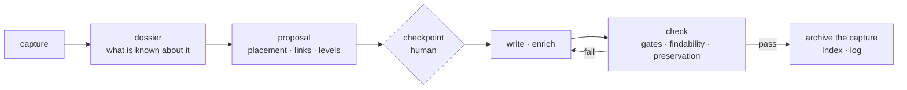

# The Distill Workflow

The procedure behind [[Two-Phase-Distillation]]. A capture in `01_Capture/` becomes a note
that keeps the best of it, sits where it belongs, links to what it draws on, and can be
found from a vague question a year later. Two tools do the mechanical parts; the agent
decides in between and stops once for review.

1. **Dossier.** `distill_judge.py --dossier` gathers everything the vault already knows:
   which notes the capture is really about ([[Typed-Judgments]]: same subject, or the
   same principle in another field), whether a note already covers the same source, where
   it belongs, which passages carry its substance, and what the graph adds ([[Farsight]]
   for candidates, [[Gaiafield]] for neighbours and suggested links). Advice with numbers,
   not decisions.
2. **Read and propose.** The agent reads the notes the dossier points at, and proposes:
   the note in its own words (mechanics, not summary), placement per PARA, related notes
   with one [[Enrichment-Levels|enrichment level]] each, and where it disagrees with the
   dossier and why.
3. **Checkpoint.** Stop. Confirm, redirect or narrow. Skipped only on an explicit `--auto`.
4. **Write and enrich.** L1 is a backlink; L2 and L3 need a cited sentence in the note
   being enriched; nothing existing is overwritten. Several related captures become one
   note each plus a hub, never one synthesis (a synthesis alone dropped two thirds of the
   specifics, 2026-09-22).
5. **Check.** `distill_check.py` is the definition of done: source carried, stored document
   linked, no link into the inbox or the archive, an Index line; and, reported for the
   agent to answer, the capture's URLs the note dropped, whether the reader's questions
   find it ([[Retrieval-Verification-Loop]]), and which kept passages it does not carry.
6. **Retire the capture** to `05_Archive/<Origin>-Captures-<YYYY-MM>/`, log it, and if
   anything stayed unresolved, a [[Dead-Letter-Queues-for-Automation|dead-letter note]]
   rather than a guess.

## Checking for prior distillation

The dossier compares the capture's own source with every note's `source:` (provenance,
decided without a model) and asks per candidate whether it is a write-up of the same
work under another address. Captures from different origins collide on the same material
more often than seems likely; see [[Capture-Conventions]].

## Related

- [[Typed-Judgments]]

- [[Two-Phase-Distillation]]
- [[Enrichment-Levels]]
- [[Capture-Conventions]]
- [[Semantic-Search-Score-Calibration]]
- [[Hybrid-Retrieval]]
- [[Dead-Letter-Queues-for-Automation]]
